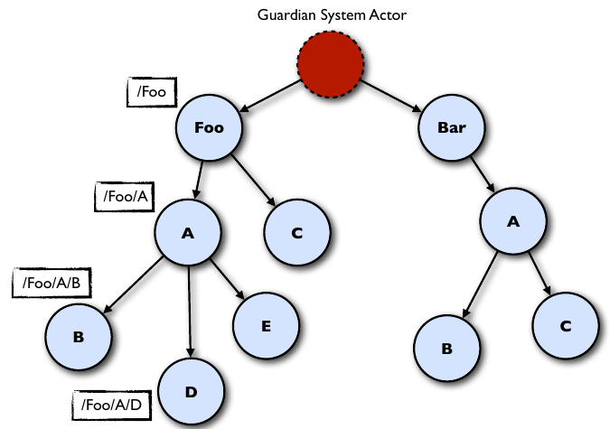
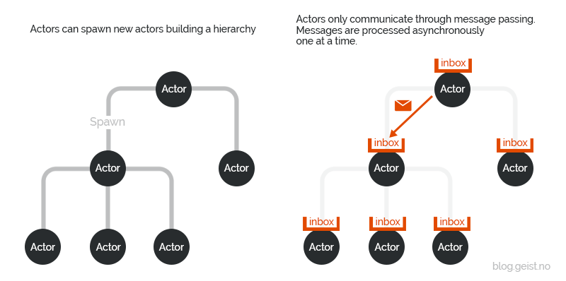
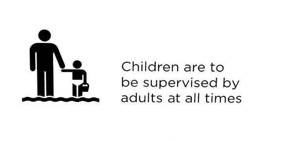
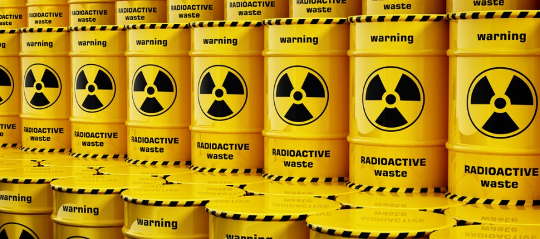
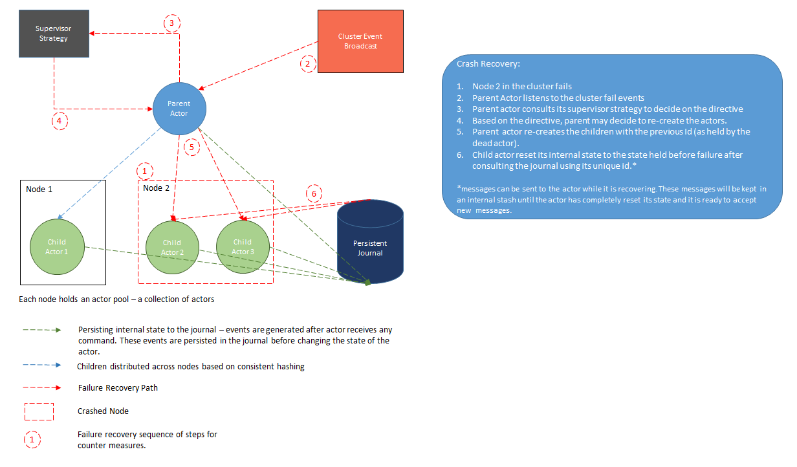

# Actor-Pattern implemented in Javascript using generators (co-routines)

While a subroutine is executed sequentially and straightly, a coroutine can suspend and resume its execution at distinct points in code. Thus, coroutines are good primitives for cooperative task handling, as coroutines are able to yield execution. The advantages of cooperative task handling especially in case of massive parallelism of asynchronous operations such as I/O are in plenty.

Coroutines are often used as low-level primitives, namely as an alternative to threads for implementing high-level concurrency concepts. For example, actor-based systems may use coroutines for their underlying implementation. This implementation attempts on the line of the above mentioned concepts.

## Parallelism vs Concurrency

The separation of the application into threads defines its concurrent model. The mapping of these threads on the available cores defines its level or parallelism. A concurrent system may run efficiently on a single processor, in which case it is not parallel.

## Generators - A brief Introduction

Most programming languages have the concept of subroutines in the form of procedures, functions, or methods. When called, a typical subroutine completes at once and returns a single value. It does not hold any state between invocations.

From the client code, a generator looks like a normal subroutine – it can be invoked and will return a value. However, a generator yields (rather than return!) a value and preserves its state – i.e. the values of the local variables. Again, this is known as continuation. When this generator is called again, its state is restored and the execution continues from the point of the last yielding until a new yield is encountered.

## Actors

The actors are the instance of any particular generator. 

The included example is based on the scenario of fund transfer between various bank accounts involving the following models:

* system-root
* account
* account-balance

## Actor Hierarchy

The guardian is the root actor of the entire system. Every other actor that is created is always a child of some actor.

## Message Passing

Every actor is associated with an address and to send message to any particular actor, an actor have to know the address of that actor.

## Fault Tolerance

When things go wrong, that’s when! Whenever a child actor has an unhandled exception and is crashing, it reaches out to its parent for help and to tell it what to do.

Specifically, the child will send its parent a message that is of the **Failure** class. Then it’s up to the parent to decide what to do.

### How Can the Parent Resolve the Error?

There are two factors that determine how a failure is resolved:

How the child failed (what type of **Exception** did the child include in its Failure message to its parent.)
What **Directive** the parent actor executes in response to a child Failure. This is determined by the parent’s **SupervisionStrategy**.

### Supervision Directives

When it receives an error from its child, a parent can take one of the following actions (“directives”). The supervision strategy maps different exception types to these directives, allowing you to handle different types of errors as appropriate.

Types of supervision directives (i.e. what decisions a supervisor can make):

* Restart the child (default): this is the common case, and the default.
* Stop the child: this permanently terminates the child actor.
* Escalate the error (and stop itself): this is the parent saying “I don’t know what to do! I’m gonna stop everything and ask MY parent!”
* Resume processing (ignores the error): you generally won’t use this. Ignore it for now.

***The critical thing to know here is that whatever action is taken on a parent propagates to its children. If a parent is halted, all its children halt. If it is restarted, all its children restart.***

### Supervision Strategies

There are two built-in supervision strategies:

* One-For-One Strategy (default)
* All-For-One Strategy

The basic difference between these is how widespread the effects of the error-resolution directive will be.

One-For-One says that that the directive issued by the parent only applies to the failing child actor. It has no effect on the siblings of the failing child. This is the default strategy if you don’t specify one. (You can also define your own custom supervision strategy.)

All-For-One says that that the directive issued by the parent applies to the failing child actor AND all of its siblings.

***The other important choice you make in a supervision strategy is how many times a child can fail within a given period of time before it is shut down (e.g. “no more than 10 errors within 60 seconds, or you’re shut down”).***

### Containment of Error
The whole point of supervision strategies and directives is to contain failure within the system and self-heal, so the whole system doesn’t crash. How do we do this?

We push potentially-dangerous operations from a parent to a child, whose only job is to carry out the dangerous task.

Suppose a particular network call is dangerous! If the request raises an error, it will crash the actor that started the call. So ***how do we protect ourselves?*** Simple, push the call to the child and it will take care of the network call isolating the error to itself and not kill the parent which might be holding a lot of other important data.

We always push the dangerous parts to the child actor. That way, if the child crashes, it doesn’t affect the parent, which is holding on to all the important data. By doing this, we are ***localizing the failure and avoiding burning of the house***.

### What if Supervisor could not respond in time?

What if there are a bunch of messages already in the supervisor’s mailbox waiting to be processed when a child reports an error? Won’t the crashing child actor have to wait until those are processed until it gets a response?

Actually, no. When an actor reports an error to its supervisor, it is sent as a special type of ***“system message.”*** System messages jump to the front of the ***supervisor’s mailbox*** and are processed before the supervisor returns to its normal processing.

***System messages jump to the front of the supervisor’s mailbox*** and are processed before the supervisor returns to its normal processing.

Parents come with a default SuperviserStrategy object (or you can provide a custom one) that makes decisions on how to handle failures with their child actors.

### How can we handle current message when an Actor Fails?

The current message in case of failure (regardless of whether the failure happened to it or its parent) can be preserved for re-processing after restarting. The most common approach is using a ***"pre-restart"***, the actor can just send the message back to itself. This way, the message will be moved to the persistent mailbox rather than staying in memory.

## Context Object

This object maintains the metadata of an object. It contains following actor information/api:

* parentSupervisor - the parent actor
* supervisedChildren - the list of supervisedChildren
* actor-system-name - the actor system the actor belongs to
* life-cycle monitoring - listens to system events  
* createChild - method to create a child actor

Context object gets created for each actor during during initialization and can be passed to the other actors if needed. Whenever an actor is restarted the child reads this object to reset its internal state.

## Journal

Whenever any message reach the dispatcher of the system it is channelized into a stream using RxJs subjects and are seamlessly written to the database without affecting the performance of the message passing in the entire actor system.

Journal records the message with the following attributes:

* message
* actorId
* timestamp

Journal is used to recover and reset the internal state of an actor in case of crash or failure.

## Crash Recovery

Crash Recovery kicks in when one of the ***node in the cluster*** crash. It results in the death of a lot of actors. 

The recovery mechanism:

* Every actor subscribes to cluster event. 
* Actors are notified when node in the cluster crashes.
* Parent actor checks if childen are alive.  
* It finds out the death of children if any.
* It looks into the SupervisorStartegy and gets a directive.
* It creates the child/children with previous ID as held by the dead child actor
* The child actor resets its internal state to the state held just before the failure after consulting the journal using the ID. 

These steps are also used when ***down-scaling of cluster*** is required

## Actor Scavenger

Scavenge job to ***remove dormant actors*** from the ***actor mapping*** periodically so that the instance can be de-refernced thus can be garbage collected.

## Testing the actor system - Chaos Monkey testing

After designing and developing everything, now its time to ***let the monkey loose in the data center*** to play with the plugs.
